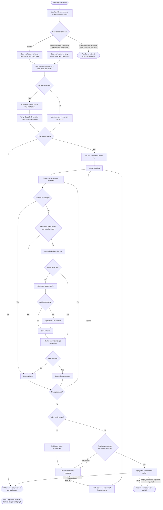

# Resolution Flow

This is the implementation reference. Start with
[Configuration](configuration.md) if you only need to choose settings.

`cargo-cooldown` runs as an outer Cargo loop.

It keeps Cargo as the source of truth for the resolved graph, but avoids
re-reading the same registry metadata inside one cooldown execution.

## 1. Execution boundary

At the beginning of one `cargo-cooldown` execution, the resolver:

1. loads config and embedded allow rules;
2. copies the Cargo workspace to a temporary directory when it needs to resolve
   or cool a lockfile;
3. renames the real root `Cargo.lock` to a temporary backup name and writes an
   invalid sentinel `Cargo.lock` while the temporary workspace is active;
4. snapshots the temp `Cargo.lock` once as the initial baseline;
5. if the requested command is `cargo cooldown update`, runs `cargo update`
   inside the temp workspace;
6. fixes a single `now` timestamp for the whole run;
7. creates one registry store that lives across every pin attempt in that run.

Cargo's stable interface does not provide a stable alternate lockfile path for
all of the commands cooldown needs. The stable implementation therefore isolates
the whole workspace instead of asking Cargo to use another `Cargo.lock`.

The workspace copy preserves workspace members and member manifests, so commands
with multiple `Cargo.toml` files keep the same Cargo workspace shape. The copied
workspace skips heavy generated directories such as `.git` and `target`; normal
workspace-local path dependencies are copied with the rest of the tree.

The real root lockfile is held while cooldown works:

- if a real `Cargo.lock` existed, it is renamed to
  `Cargo.lock.cooldown-backup.<id>`;
- an invalid sentinel is written at `Cargo.lock`, so an accidental plain
  `cargo build` against the real workspace fails instead of resolving from a
  half-finished lockfile;
- on normal failure, rejection, or `strict` enforcement, the backup is restored;
- on success, the final temp `Cargo.lock` is published back to the real
  workspace and the backup is removed.

If the process is killed abruptly, Rust destructors may not run. In that case
the real workspace can be left with the sentinel plus the
`Cargo.lock.cooldown-backup.<id>` file; restore by moving the backup back to
`Cargo.lock`.

The baseline snapshot is taken before any Cargo command is allowed to rewrite
the temp lockfile.

- for forwarded commands other than `update`, the snapshot happens before
  `cargo metadata` and before any fallback `cargo generate-lockfile` when the
  lockfile is missing. The intended supply-chain guard commands are
  `check`, `build`, `test`, and `run`, because they consume the lockfile before
  Cargo downloads, compiles, tests, or runs dependency code. With the default
  `lockfile_baseline = "floor"`, versions already present in that snapshot are
  protected as the baseline and are not cooled. Set `lockfile_baseline` to
  `"ignore"` when these commands should inspect and cool the current lockfile
  itself before Cargo consumes it;
- for `cargo cooldown update`, the snapshot happens before `cargo update`.
  `cargo update` then writes its result to the temp `Cargo.lock`, not to the
  user-visible lockfile. The later cooldown pass evaluates that post-update temp
  lockfile against the pre-update baseline.

So `cargo cooldown update` can temporarily put fresh dependency versions in the
temp `Cargo.lock`, but not in the real root `Cargo.lock`. They are not accepted
as the final result until the cooldown pass finishes and the active enforcement
policy allows the remaining graph. If the run fails, rejects the
`cargo_compatible` prompt, or hits `strict` enforcement, cargo-cooldown restores
the real pre-run lockfile.

If cooldown is disabled with `enforcement = "off"` or `cooldown_minutes = 0`,
`cargo cooldown update` still runs the update in the temporary workspace and then
publishes Cargo's updated lockfile without a cooldown pass. Other forwarded
Cargo commands skip the isolation step when cooldown is disabled.

During the temp resolution phase, Cargo may refresh registry/index metadata in
`CARGO_HOME`. Normal registry crate source archives are not fetched just because
`cargo update` or `cargo metadata` changed a lockfile; source downloads happen
when a later command such as `cargo build`, `cargo check`, `cargo test`,
`cargo run`, or `cargo fetch` needs the crate contents.

That boundary matters because the current implementation already caches:

- registry contexts by source ID;
- release timelines in memory by `(source_id, crate_name)`;
- locked-version age inspections by `(source_id, crate_name, current_version, minimum_minutes)`.

So even though Cargo is re-run after each successful pin, the resolver does not
need to rebuild the same registry timeline or re-evaluate the same locked
version more than once inside the same process, and it does not recalculate the
initial lockfile baseline after later pins.

If any later cooldown step fails after Cargo has already rewritten the temp
`Cargo.lock`, the resolver restores the exact temp lockfile contents that were
present at process start before returning the error. Under `strict`, or when a
`cargo_compatible` unresolved-fresh-version prompt is rejected or cannot run
interactively, the real lockfile guard restores the original root `Cargo.lock`.
For `cargo cooldown update`, other guard failures downgraded by
`cargo_compatible` restore and publish Cargo's post-update temp lockfile instead
of silently leaving the real lockfile unchanged.

That means `cargo cooldown update` has this exact shape:

1. copy the workspace to a temp directory;
2. hold the real root `Cargo.lock` with a backup plus sentinel;
3. read and snapshot the temp copy of the current `Cargo.lock`;
4. run `cargo update`, letting Cargo write the newest graph it accepts to the
   temp `Cargo.lock`;
5. inspect that updated temp lockfile;
6. with `lockfile_baseline = "floor"`, exempt any `(registry, crate, version)`
   that was already present in the original snapshot;
7. pin only the newly introduced or version-changed fresh entries, but allow
   them to return to an exact version from the original snapshot even if that
   baseline version is still fresher than the cutoff;
8. with `lockfile_baseline = "floor"`, reject any cooldown assignment that would
   downgrade a package below the newest version of that package already present
   in the original snapshot;
9. if the cooldown step fails under `strict` enforcement, or if
   `cargo_compatible` asks for unresolved fresh-version approval and approval is
   not given, restore the original real lockfile;
10. otherwise publish the final temp `Cargo.lock` to the real workspace.

## 2. Graph scan and release-age inspection

On each outer pass, `cargo-cooldown` runs `cargo metadata` in the active
workspace copy and rebuilds the derived cooldown state from Cargo's current
resolved graph.

For each registry package in the selected dependency closure:

1. resolve the effective registry location from Cargo's own configuration;
2. skip the package immediately if its registry is in `skip_registries`;
3. skip the package if it matches an exact allow rule or its effective cooldown
   is `0`;
4. if `lockfile_baseline = "floor"`, skip the package when the exact locked
   `(registry, crate, version)` was already present in the initial lockfile
   baseline;
5. inspect the locked version age.

For `cargo cooldown update`, step 4 compares the updated temp lockfile against
the pre-update snapshot. So a version that was already in the real `Cargo.lock`
before the update remains exempt, while a version introduced by `cargo update`
is eligible for cooldown. If `cargo update` moves `foo 1.2.3` to `foo 1.2.4`,
cooldown may pin `foo` back to `1.2.3` even when `1.2.3` is still fresh, because
that exact version was already part of the baseline snapshot. With the default
`lockfile_baseline = "floor"`, it will not pin `foo` below `1.2.3` during that
update run. With `lockfile_baseline = "ignore"`, the pre-update snapshot is not an
exemption, so `foo` can be cooled below `1.2.3` when Cargo accepts the result.

The age inspection itself works like this:

1. load the crate timeline from the in-memory cache if it is already known;
2. otherwise read the local registry index cache for that crate;
3. use `pubtime` as the authoritative timestamp when it is present;
4. if `pubtime` is missing, attempt one fallback HTTP request for that crate;
5. merge the local index data and fallback data into one release timeline;
6. cache that timeline in memory for the rest of the run;
7. cache the age result for the locked version so the same version is not
   re-inspected after later pins.

If a package is not skipped and still lacks a usable timestamp after local
index plus fallback, the cooldown step fails under `strict` enforcement and
becomes a warning under `cargo_compatible` enforcement.

## 3. Candidate selection and pin loop

For each non-skipped package whose locked version is younger than the cooldown
cutoff:

1. collect all `VersionReq` constraints observed in the resolved graph;
2. walk the timeline from newest to oldest;
3. pick the first release that:
   - is not yanked;
   - is lower than the locked version;
   - satisfies every observed requirement;
   - and is either older than the cutoff or already present in the initial
     lockfile baseline when `lockfile_baseline = "floor"`.

Fresh packages are first considered for one bulk lockfile assignment. Cooldown
selects older candidates, builds local dependency components from registry
metadata, follows both dependencies and current reverse dependents that would be
broken by a lower version, and searches a bounded set of compatible
assignments. Local solver identities are `(registry, crate, current locked
version)`, and candidate dependencies are mapped through Cargo's current
resolved `PackageId` graph before falling back to semver matching. That lets
components include multiple locked versions of the same crate, such as
`getrandom 0.2` and `getrandom 0.3`, without conflating their constraints. It
then rewrites those package entries in `Cargo.lock` and asks Cargo to validate
the result. The fast validation starts with a locked metadata pass; if Cargo
only needs to refresh lockfile dependency entries, cooldown allows one normal
metadata pass and then checks the result with locked metadata again. If Cargo
rejects the batch, cooldown restores the previous lockfile and prunes the
reported blockers. The retry budget grows logarithmically with batch size and
stops early for broad batches where each rejection removes too little of the
candidate set to converge cheaply.

If Cargo rejects a pin because another package blocks it, the blocker is queued
and the resolver keeps working inside that same pass.

Two details matter here:

- the same `(registry, crate, version)` is not retried more than once in a
  single lockfile pass, because the lockfile has not changed yet and a second
  attempt would be redundant;
- if the only remaining blockers are outside the selected cooldown scope,
  protected by the initial lockfile baseline, already exhausted earlier in the
  run, or otherwise cooldown-exempt, the resolver keeps the currently
  locked version, emits a warning, and continues cooling the rest of the graph.

If a batch succeeds, the resolver restarts from `cargo metadata` so Cargo can
re-resolve the graph from the new lockfile state. Cargo-compatible skips stay
tied to the exact `(registry, crate, version)` that was skipped, so the same
fresh version is not requeued again through blocker propagation after a restart.
The initial baseline does not change, so any package that moves to a version not
present in that baseline becomes eligible for cooldown on the next pass.

If a pass makes no successful pins but does record new cargo-compatible skips,
the resolver also restarts from `cargo metadata` once so those skipped versions
are left out of the next freshness queue instead of ending in a generic
fixed-point error immediately.

Before giving up on the remaining cargo-compatible set, cooldown runs one more
bounded pass for small resolver-constrained bundles linked by exact version
requirements. It searches a small set of mutually compatible older versions
using local index dependency metadata, rewrites that bundle in `Cargo.lock` as
one coordinated candidate state, and asks Cargo to validate the result. This
helps for tightly coupled stacks such as `js-sys` / `wasm-bindgen*` / `web-sys`,
where no single-package downgrade can make progress from the current lockfile
but a coordinated older bundle is still valid.

At the end of the run, cooldown emits one user-facing summary block. For cooled
packages, it renders Cargo-style lines from the initial `Cargo.lock` version to
the final frozen version, and appends `(latest: ...)` when the run first moved
through a fresher version. If fresh versions still remain it also distinguishes
between:

- versions that were already present in the initial `Cargo.lock` baseline; and
- versions that the resolver had to keep fresh because no further compatible
  cooldown pin was possible in this run.

That final distinction also drives the enforcement policy:

- `strict` fails if any resolver-constrained fresh versions remain and restores
  the original lockfile
- `cargo_compatible` prompts before keeping the resulting lockfile and prints
  one warning block with those remaining fresh versions, unless
  `cargo_compatible_accept = "auto"` is configured

The main scalability goal of the batch solver is to avoid one Cargo resolver
invocation per independent fresh crate. The bulk path handles the common case
where many packages can be cooled together while keeping Cargo as the final
validator for the resulting graph.
